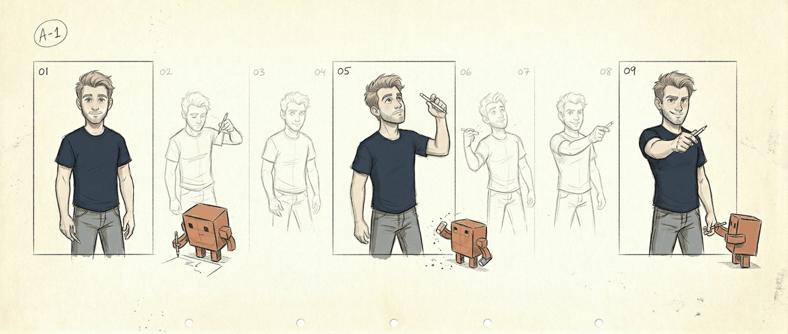

  

# Sean Winslow

AI Product Manager · a creative who learned to think like a PM, now shipping with a fleet of agents

> The agents handle the loops. I handle the taste.

I build at the seam where creative work meets autonomous systems — I design the pipeline, make the calls that need taste, and let a fleet of agents do everything that can be made cheap, parallel, and structured.

## What I'm building

- **[anima](https://github.com/seanwinslow28/anima)** — a 2D-animation pipeline run by a human and a fleet of agents. Ten phases, a critic stack, a human gate at every taste call.
- **[code-brain](https://github.com/seanwinslow28/code-brain)** — my command center: 100+ skills and 9 autonomous agents running my second brain on a schedule.
- **[intent-engineering-mcp](https://github.com/seanwinslow28/sw-mcp-intent-engineering)** — an MCP server that tells agents to act with intent.
- **[VoicePrint]((https://github.com/seanwinslow28/voiceprint))** — the first project in my "Raising Claude" series where the main goal is to have the machine's think like me.

## How I work

Nine agents run on a schedule, backed by 100+ skills. They draft, research, QA, and remember. I own timing, casting, and taste — and the final call to ship.

🟢 **Currently open to AI, Technical, and Creative PM roles**

### See the full portfolio → [seanwinslow.com](https://seanwinslow.com)

[Portfolio](https://seanwinslow.com) · [Email](mailto:sean.winslow28@gmail.com) · [LinkedIn](https://www.linkedin.com/in/sean-winslow-204390a5) · [Substack](https://substack.com/@seanpwins)
